# Diagrams — Main / Worker Service Architecture

**Spec:** `19-main-worker-service`
**Format:** Mermaid (`.mmd`). Render in any Mermaid viewer or the in-app docs viewer.

---

## ⚠ Non-Authoritative Projection — read first

**Every `.mmd` file in this folder is an illustrative projection, not a source of truth.**

| Aspect | Rule |
|--------|------|
| Authority | The prose specs cited at the top of each `.mmd` (and in the table below) are authoritative. |
| Conflict resolution | If a diagram disagrees with its cited spec, **the spec wins** and the diagram is filed as a bug (FU). |
| Drift policy | Diagrams MAY lag spec edits by up to one task cycle; readers must cross-check tunable values, error codes, and tier allocations against the cited spec. |
| Banner contract | Each `.mmd` opens with a `%% NON-AUTHORITATIVE PROJECTION` block naming its subject + authoritative source(s). Do not strip this block. |

| Diagram | Authoritative source(s) |
|---------|-------------------------|
| `erd-main-db.mmd` | `02-main-server.md` + `spec/04-database-conventions/` |
| `erd-worker-split-db.mmd` | `spec/05-split-db-architecture/` + `11-split-db-tier-reconciliation.md` |
| `erd-seedable-config.mmd` | `spec/06-seedable-config-architecture/` + `14-rbac-and-status-seed.md` |
| `seq-company-creation.mmd` | `04-worker-routing.md` + `15-tunable-constants.md` |
| `seq-login-routing.mmd` | `12-jwt-delivery-contract.md` + `04-worker-routing.md` |
| `seq-ui-endpoint-discovery.mmd` | `12-jwt-delivery-contract.md` + `04-worker-routing.md` + `06-core-api-endpoints.md` |
| `seq-login-edge-cases.mmd` | `12-jwt-delivery-contract.md` + `04-worker-routing.md` + `06-core-api-endpoints.md` + `08-error-contract.md` |
| `seq-push-update.mmd` | `spec/14-update/28-worker-push-instruction.md` + `15-tunable-constants.md` |
| `erd-backup-tier.mmd` | `19-incremental-backup-sync.md` + `20-backup-encryption-and-keys.md` + `22-backup-apply-logic.md` + `23-snapshot-storage-and-restore.md` |
| `seq-incremental-backup.mmd` | `19-incremental-backup-sync.md` + `21-backup-endpoints.md` + `22-backup-apply-logic.md` |
| `seq-backup-restore.mmd` | `23-snapshot-storage-and-restore.md` + `21-backup-endpoints.md` |
| `flow-trust-boundaries-and-git-backup.mmd` | `26-trust-boundaries-and-isolation.md` + `27-git-backup-targets.md` + `18-backup-nodes.md` + `19-incremental-backup-sync.md` |

Resolves audit findings F-D-01..F-D-12 (diagram-authority cluster) and the last BLOCKER from `audit/03-diagram-audit.md`. Phase 12 (2026-05-06) added the three Backup-tier diagrams listed above.

---

## ERDs

| File | Subject |
|------|---------|
| [`erd-main-db.mmd`](erd-main-db.mmd) | Main Server SQLite catalog (10 tables: WorkerNode, Company, User, Role, etc.) |
| [`erd-worker-split-db.mmd`](erd-worker-split-db.mmd) | Worker-side split-DB tiers (Root / App / Session). Authoritative rules in `spec/05-split-db-architecture/`. |
| [`erd-seedable-config.mmd`](erd-seedable-config.mmd) | Seedable-Config layout shared by both tiers. Authoritative rules in `spec/06-seedable-config-architecture/`. |
| [`erd-backup-tier.mmd`](erd-backup-tier.mmd) | Backup-tier App-DB tables (Phases 7–11): SyncOpLedger, BackupPairing, BackupKeyEpoch, BackupSyncWatermark, BackupOutboxEnvelope, BackupApplyIdempotency, BackupApplyDeadLetter, BackupSnapshotCatalog/Job, BackupRestoreJob. |

## Sequence Diagrams

| File | Flow |
|------|------|
| [`seq-company-creation.mmd`](seq-company-creation.mmd) | `POST /API/V1/Company` end-to-end: validate → strategy pick → main insert → worker delegate → split-DB create. |
| [`seq-login-routing.mmd`](seq-login-routing.mmd) | Sign-in → 2FA → cache lookup → mint worker JWT → React calls Worker directly → token refresh. |
| [`seq-ui-endpoint-discovery.mmd`](seq-ui-endpoint-discovery.mmd) | Three-phase view of UI endpoint learning: discovery on login, direct Worker calls, endpoint refresh on 401 / near-expiry. |
| [`seq-login-edge-cases.mmd`](seq-login-edge-cases.mmd) | Edge-case lanes: 2FA failure (`MAIN-2FA-001/002`), JWT expiry + 401 retry (`MAIN-401-001`), and worker reassignment mid-session (`MAIN-RTNG-003`). |
| [`seq-push-update.mmd`](seq-push-update.mmd) | Power Admin push-update fan-out, parallel worker hits, partial-failure handling. |
| [`seq-incremental-backup.mmd`](seq-incremental-backup.mmd) | Primary → Backup CDC flow: SyncOp → envelope seal → BE-1 → 5-stage Apply pipeline → ACK + watermark advance. |
| [`seq-backup-restore.mmd`](seq-backup-restore.mmd) | Operator restore-by-date: BE-3 enqueue → snapshot decrypt → re-seal under current Active KeyEpoch → BE-6 import → watermark realign. |

## Architecture / Trust Flows

| File | Flow |
|------|------|
| [`flow-trust-boundaries-and-git-backup.mmd`](flow-trust-boundaries-and-git-backup.mmd) | Trust gradient (Main → Worker → Backup → Git) and the forbidden reverse channels enforced by chs. 26 + 27. Includes the optional git-push lane for cold off-site archives. |

---

## Diagram gallery (source ↔ rendered PNG)

Each row links the authoritative Mermaid source and its committed PNG export. PNGs are regenerated by `npm run diagrams:rebaseline` and drift-checked on every PR (`.github/workflows/diagrams-ci.yml`).

### ERDs

| Diagram | Mermaid source | Rendered PNG |
|---------|---------------|--------------|
| Main-DB catalog | [`erd-main-db.mmd`](erd-main-db.mmd) | [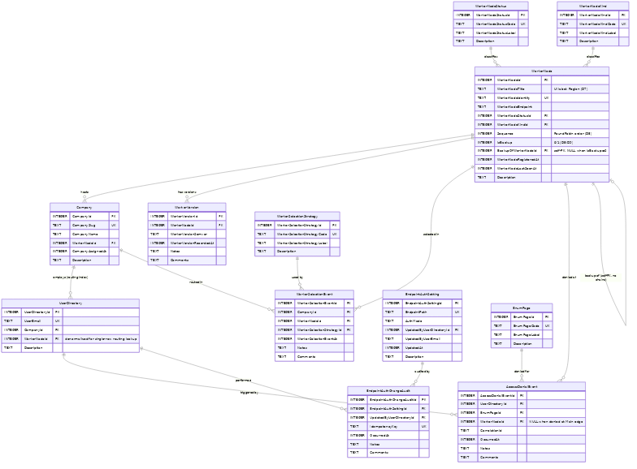](erd-main-db.png) |
| Worker split-DB tiers | [`erd-worker-split-db.mmd`](erd-worker-split-db.mmd) | [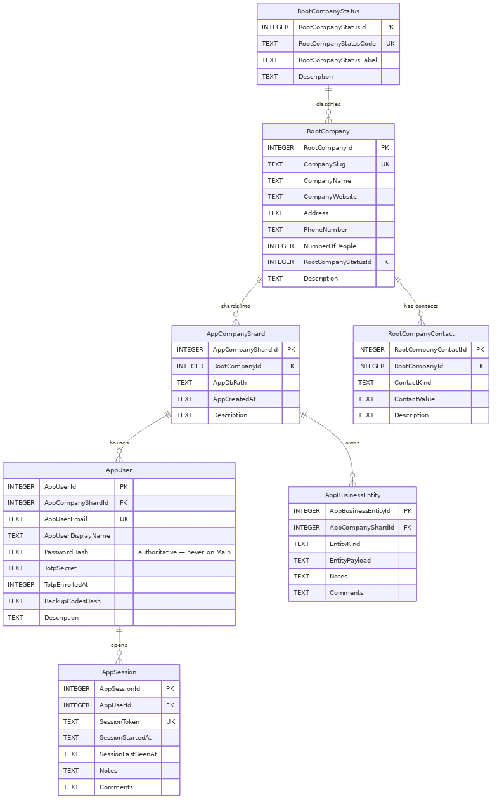](erd-worker-split-db.png) |
| Seedable-Config layout | [`erd-seedable-config.mmd`](erd-seedable-config.mmd) | [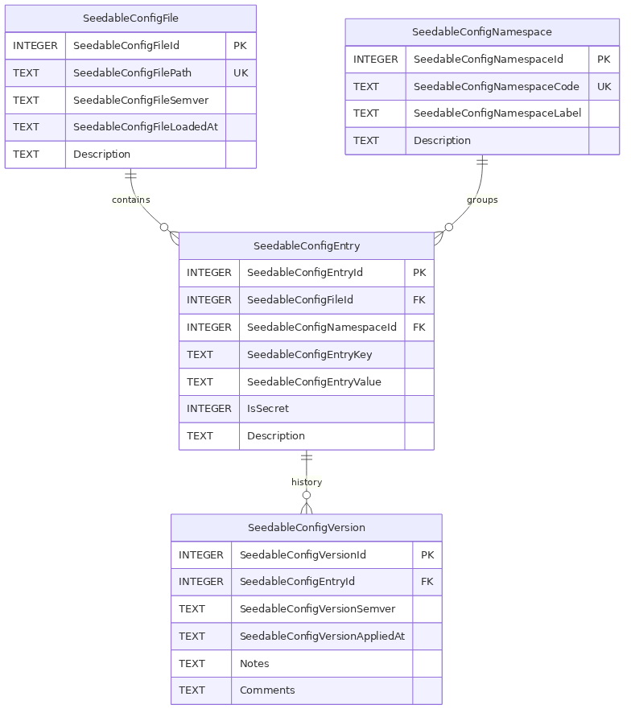](erd-seedable-config.png) |
| Backup-tier App-DB | [`erd-backup-tier.mmd`](erd-backup-tier.mmd) | [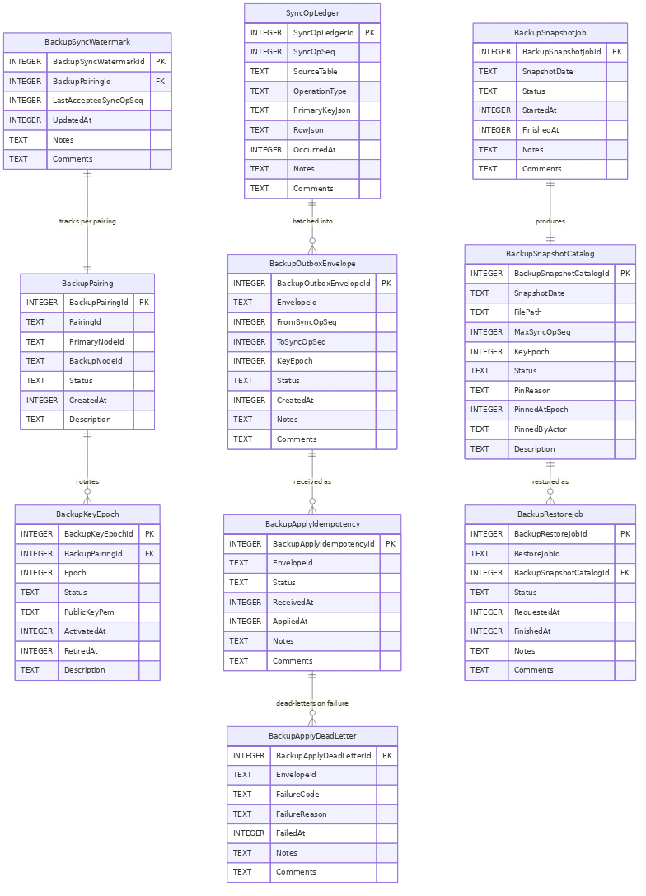](erd-backup-tier.png) |

### Sequence flows

| Diagram | Mermaid source | Rendered PNG |
|---------|---------------|--------------|
| Company creation | [`seq-company-creation.mmd`](seq-company-creation.mmd) | [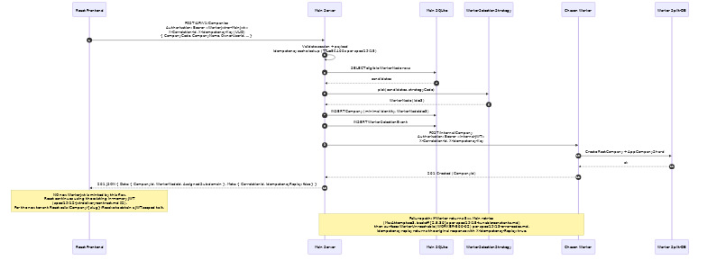](seq-company-creation.png) |
| Login + worker routing | [`seq-login-routing.mmd`](seq-login-routing.mmd) | [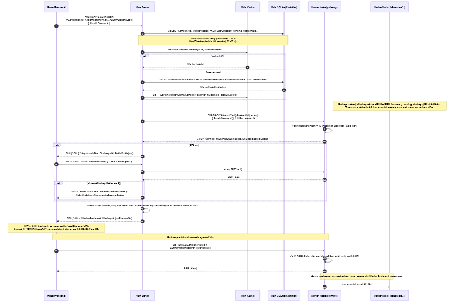](seq-login-routing.png) |
| UI endpoint discovery | [`seq-ui-endpoint-discovery.mmd`](seq-ui-endpoint-discovery.mmd) | [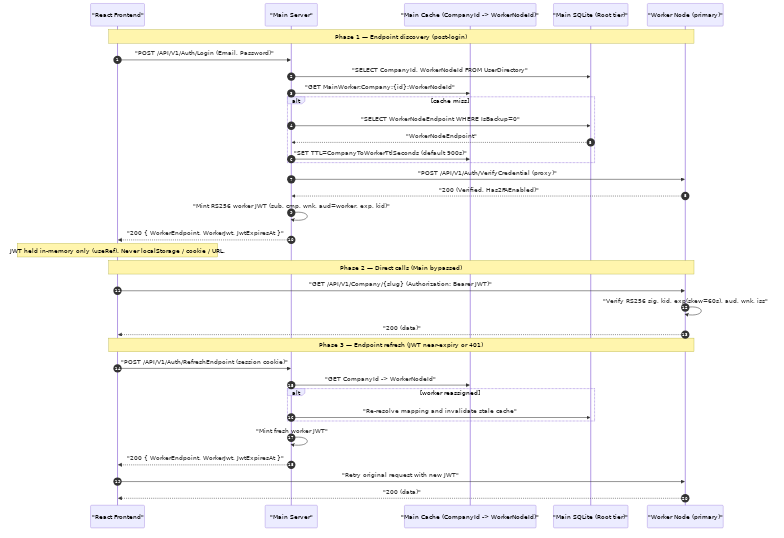](seq-ui-endpoint-discovery.png) |
| Login + endpoint edge cases | [`seq-login-edge-cases.mmd`](seq-login-edge-cases.mmd) | [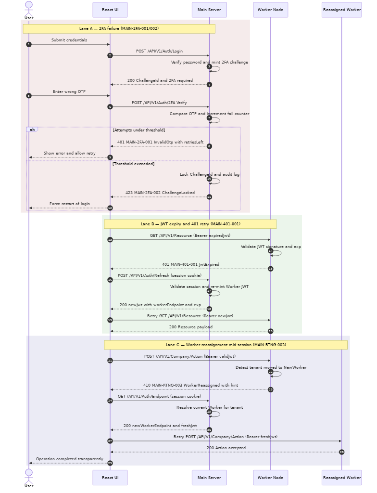](seq-login-edge-cases.png) |
| Push update fan-out | [`seq-push-update.mmd`](seq-push-update.mmd) | [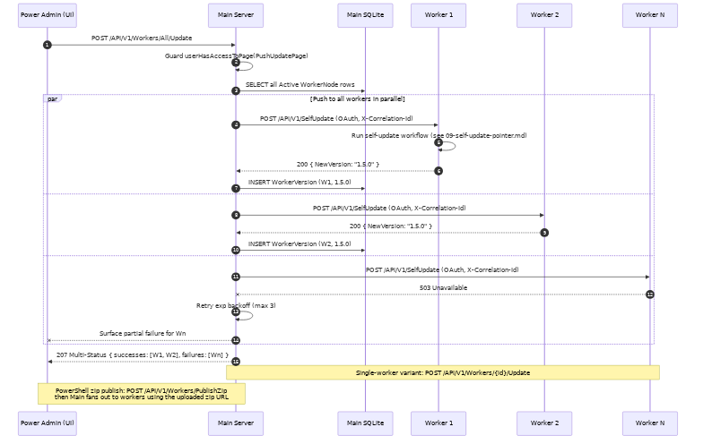](seq-push-update.png) |
| Incremental backup CDC | [`seq-incremental-backup.mmd`](seq-incremental-backup.mmd) | [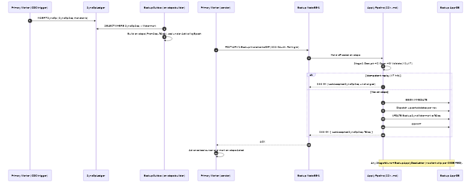](seq-incremental-backup.png) |
| Backup restore | [`seq-backup-restore.mmd`](seq-backup-restore.mmd) | [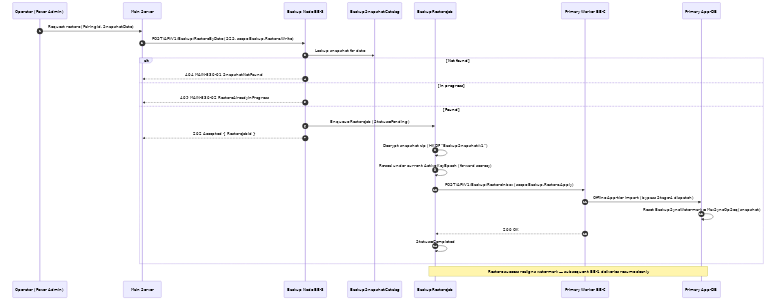](seq-backup-restore.png) |

### Architecture / trust flows

| Diagram | Mermaid source | Rendered PNG |
|---------|---------------|--------------|
| Trust boundaries + git backup | [`flow-trust-boundaries-and-git-backup.mmd`](flow-trust-boundaries-and-git-backup.mmd) | [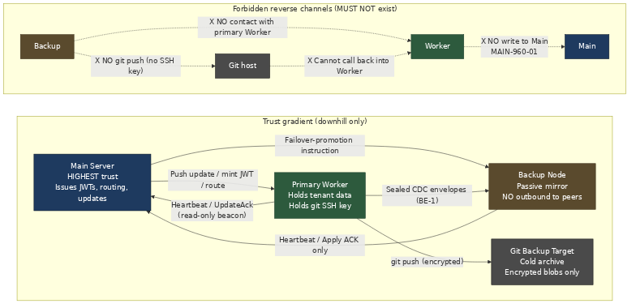](flow-trust-boundaries-and-git-backup.png) |

---

## Conventions

- PascalCase entity and column names (matches `spec/04-database-conventions/`).
- PKs `{TableName}Id INTEGER`. No UUIDs.
- Entity/ref tables show `Description`. Transactional tables show `Notes` + `Comments` (memory rules 11/12).
- No emojis in diagram syntax (Mermaid lexer constraint).

---

## Rendering pipeline (closes audit-09 §2.2)

`scripts/render-diagrams.mjs` discovers every `spec/**/diagrams/*.mmd` file and renders sibling `*.png` outputs.

| Command | Purpose |
|---------|---------|
| `npm run diagrams:render` | Render every `.mmd` whose `.png` is missing or older than the source. Requires `npx @mermaid-js/mermaid-cli` available locally. |
| `npm run diagrams:render -- --only spec/19` | Scope to one spec folder (substring match). |
| `npm run diagrams:check` | Drift guard: passes when every existing `.png` is fresh, or when no `.png` files exist yet (adoption is opt-in). Fails only when a `.png` is present but **older** than its `.mmd`. Safe to wire into CI without forcing PNG adoption. |

**Adoption policy.** Per the diagrams readme banner (top of file), `.mmd` is the authoritative source and PNGs are convenience renders only. CI runs `diagrams:check` (drift-only), never `diagrams:render` (which needs a Mermaid runtime). Authors choose when to commit PNGs; once committed, `diagrams:check` keeps them honest.

---

*Diagrams index v1.2.0 — 2026-05-07 (Phase 13.5: render-diagrams.mjs + npm scripts wired; closes audit-09 §2.2).*
